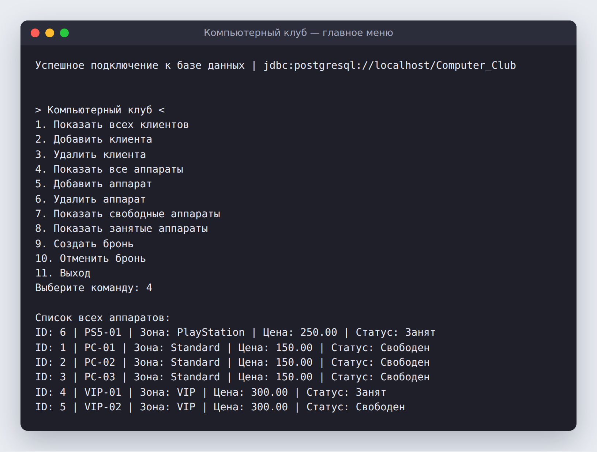
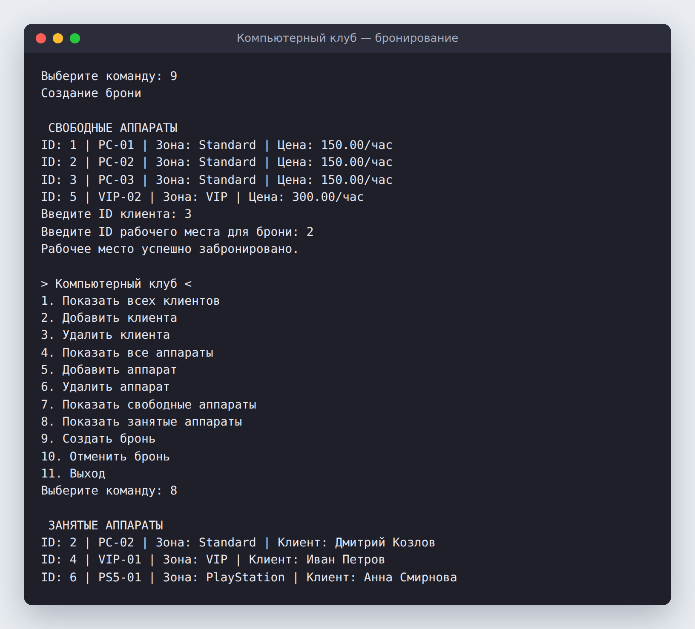
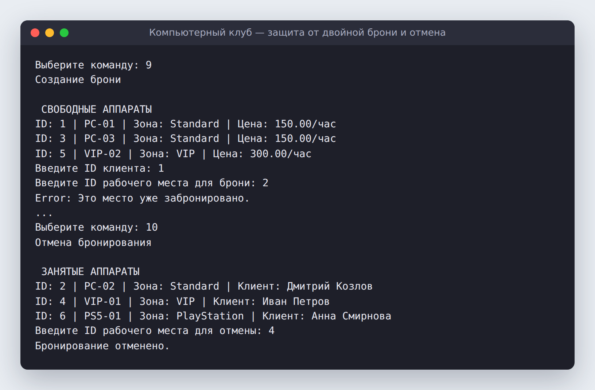
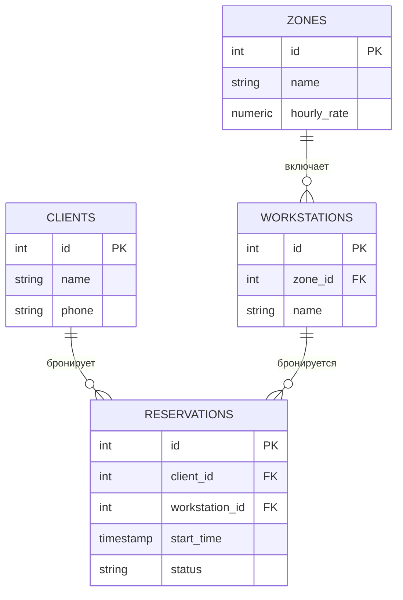

# 🎮 Компьютерный клуб

Консольное приложение на **Java + JDBC + PostgreSQL** для администратора компьютерного клуба. В нём ведётся учёт клиентов и игровых мест по зонам (Standard, VIP, PlayStation), а места можно бронировать и освобождать.


---

## 📸 Как это выглядит

**Главное меню и список аппаратов:** для каждого места видны зона, цена за час и текущий статус



**Бронирование:** программа показывает только свободные места, а после брони место появляется в списке занятых



**Защита от двойной брони и отмена:** уже занятое место забронировать повторно не получится



---

## ✨ Возможности

- 👤 **Клиенты:** просмотр, добавление и удаление
- 🖥️ **Аппараты:** список всех мест с зоной, ценой и статусом, добавление в нужную зону, удаление
- 🟢 **Свободные и занятые места:** отдельные списки, у занятых мест показано имя клиента
- 📅 **Бронирование:** создание брони на свободное место и её отмена (статус меняется на `completed`)
- 🛡️ **Надёжность:** все запросы параметризованы через `PreparedStatement`, поэтому SQL-инъекции исключены. Повторная бронь отлавливается по коду ошибки PostgreSQL `23505` (unique violation), и пользователь видит понятное сообщение
- 🔌 **Проверка окружения:** при старте программа проверяет, что JDBC-драйвер подключён и база доступна

## 🧠 Интересное внутри

Статус места («Свободен» / «Занят») не хранится в отдельной колонке, а вычисляется запросом через `LEFT JOIN` с активными бронями:

```sql
SELECT w.id, w.name, z.name AS zone_name, z.hourly_rate,
       CASE WHEN r.id IS NULL THEN 'Свободен' ELSE 'Занят' END AS status
FROM workstations w
JOIN zones z ON w.zone_id = z.id
LEFT JOIN reservations r ON w.id = r.workstation_id AND r.status = 'active'
```

Правило «одно место — не больше одной активной брони» проверяет сама база с помощью частичного уникального индекса:

```sql
CREATE UNIQUE INDEX one_active_reservation ON reservations(workstation_id) WHERE status = 'active';
```

## 🗄️ Структура базы данных



Скрипт создания таблиц и тестовые данные лежат в [`database/schema.sql`](database/schema.sql).

## 🚀 Запуск

**Нужно:** JDK 17+, PostgreSQL и [JDBC-драйвер PostgreSQL](https://jdbc.postgresql.org/download/).

1. Создай базу и таблицы:
   ```bash
   psql -U postgres -c "CREATE DATABASE \"Computer_Club\";"
   psql -U postgres -d Computer_Club -f database/schema.sql
   ```
2. Подключи `postgresql-*.jar` к проекту (в IntelliJ IDEA: *Project Structure → Libraries*) и запусти `PC_CLUB.main()`.

   Из терминала то же самое делается так:
   ```bash
   javac -d out src/PC_CLUB.java
   java -cp out:postgresql-42.7.5.jar PC_CLUB     # на Windows вместо ":" поставь ";"
   ```

По умолчанию программа подключается к `localhost/Computer_Club` с логином и паролем `postgres/postgres`. Эти значения задаются константами в начале `PC_CLUB.java`.

## 🛠️ Стек

Java · JDBC · PostgreSQL · SQL (JOIN, CASE, частичные индексы)
